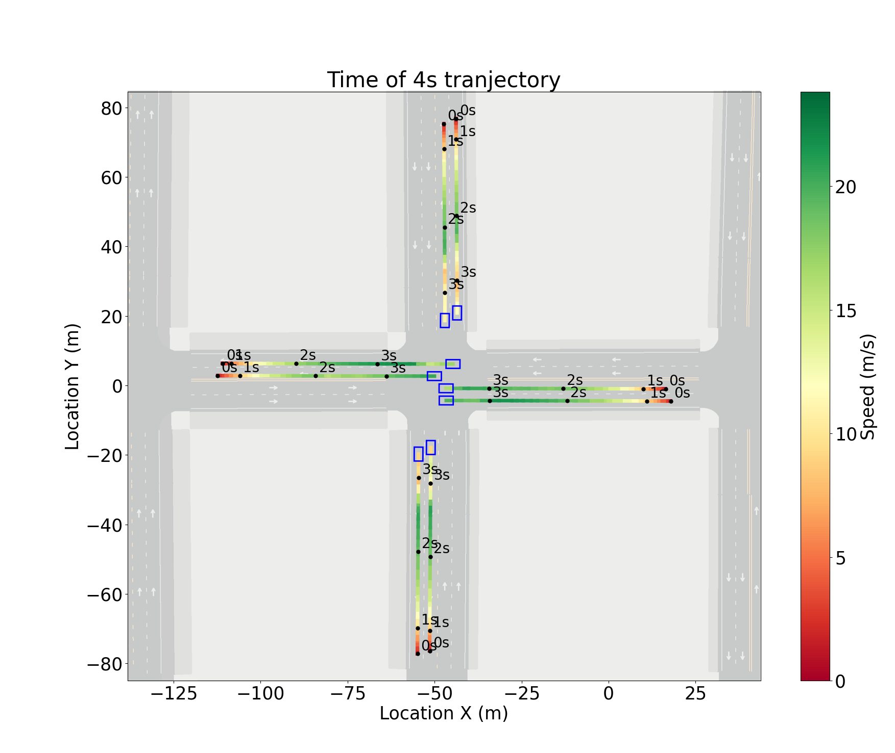

# PY_trajectory
A beautiful trajectory visualization library for autonomous vehicle tracking in Python

## Usage

### First clone this repo:

```shell
git clone --depth 1 https://github.com/Gaochengzhi/PY_trajectory
cd PY_trajectory
```

### Run the demo:

```shell
pip install -r requirements.txt
python3 main.py --file=data/data0.csv
```

Then you can get your plot in `./res` folder

### Use in your data file

Replace the parameters:

```python
## parameters
font_size = 25
step_per_frame = 10
fig_width = 20
fig_height = 15
cmap_style = "RdYlGn"
time_coloumn = "time"
id_coloumn = "vehicle_id"
yaw_coloume = "rotation_yaw"
loc_x = "location_x"
loc_y = "location_y"
time_spot_font_size = 20
time_spot_size = 5
```

And customize the function:

```python3
def calculate_velocity(row):
  """return speed in m/s"""
  pass
def draw_vehicle(ax, x, y, yaw, color="blue"):
  "draw your vehicle"
  pass
```



